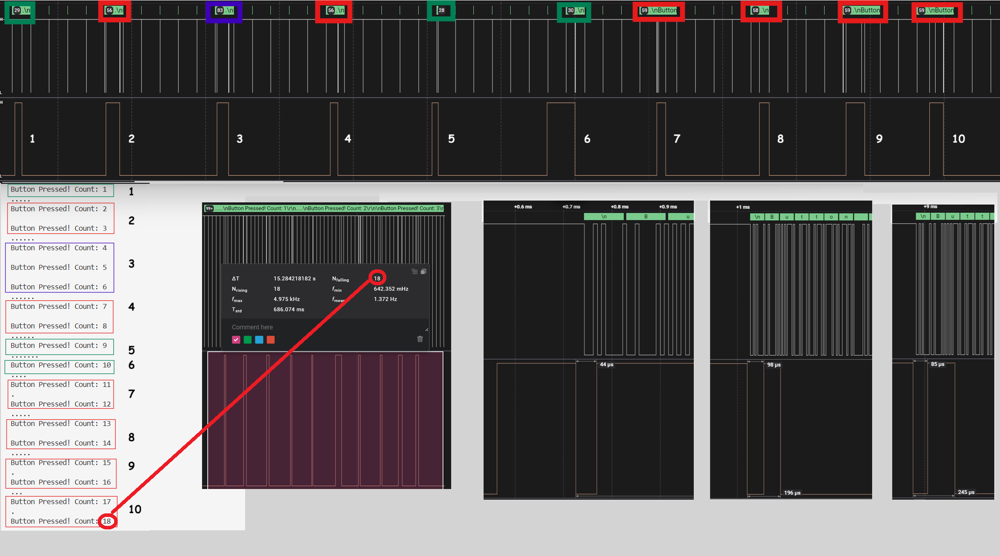
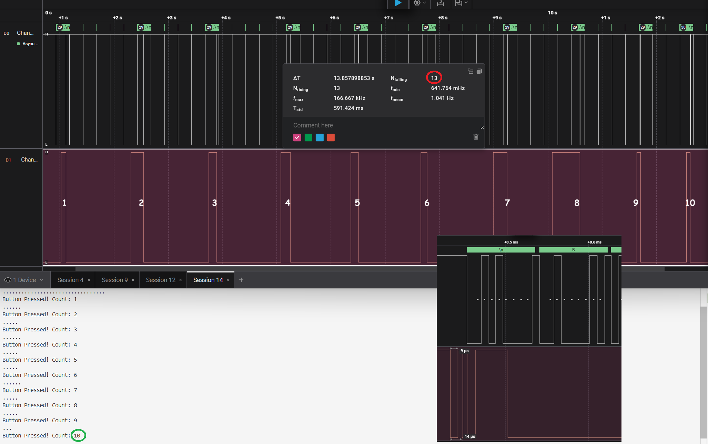
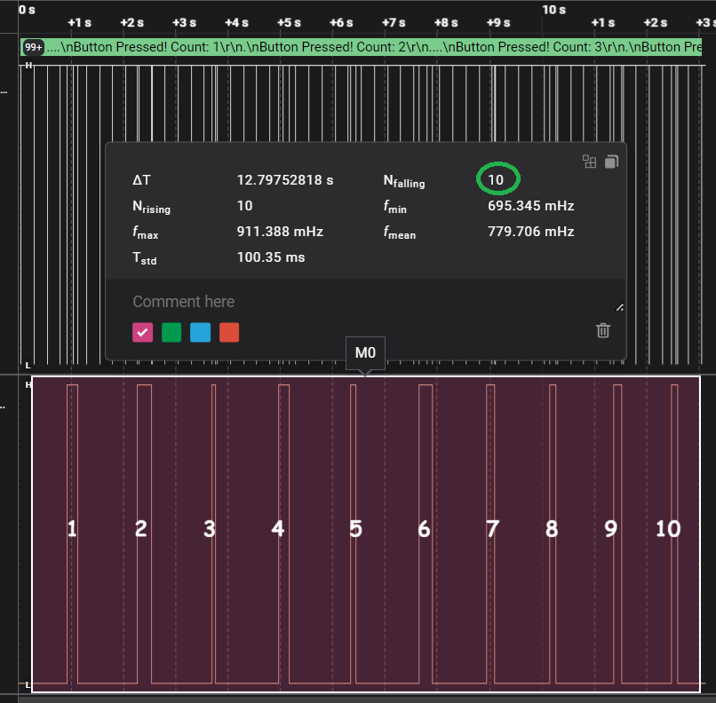

# Модуль 1.5. Звіт

## Завдання

[README.md](../README.md)

## Хід роботи

### Код

[main.cpp](../src/main.cpp)

### Експеримент 1. Output на кожному FALLING

Кнопка натиснута 10 разів, а в monitor відображається 18 "Button Pressed!" через bounce. На зображенні з логічного аналізатора видно 18 FALLING.

Брязкіт з'являється при повільнішому натисканні-відпусканні кнопки. На логічному аналізаторі видно, що частина імпульсів пропускається мікроконтролером через затримку в обробці переривань.

Середня тривалість брязкоту порядка 100 мікросекунд.

Мінімальний debounce у розмірі max bounce duration повинен програмно вирішити проблему.

### Експеримент 2. Program debounce

Додан програмний фільтр розміром 5 мілісекунд

Кнопка натиснута 10 разів, в monitor відображається 10 "Button Pressed!" - фільтр вирішив проблему на програмному рівні.

Але на зображенні з логічного аналізатора все ще видно 13 FALLING.

### Експеримент 3. Конденсатор

Паралельно кнопці додан конденсатор ємністю 10 нФ.

Як видно на зображенні з логічного аналізатора, 10 натискань дають 10 FALLING.
