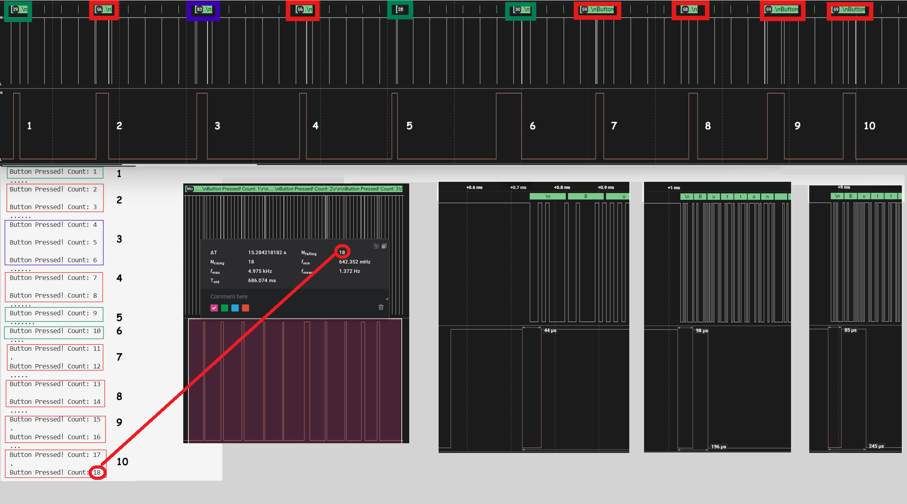
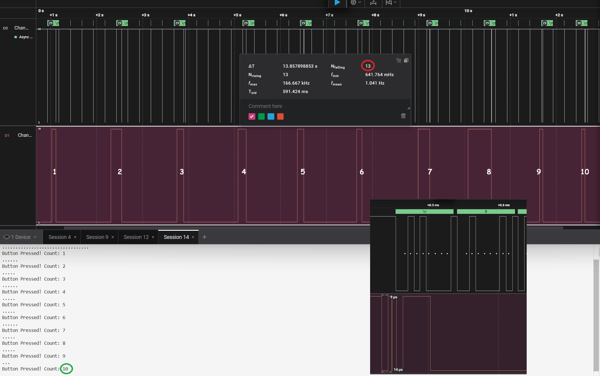
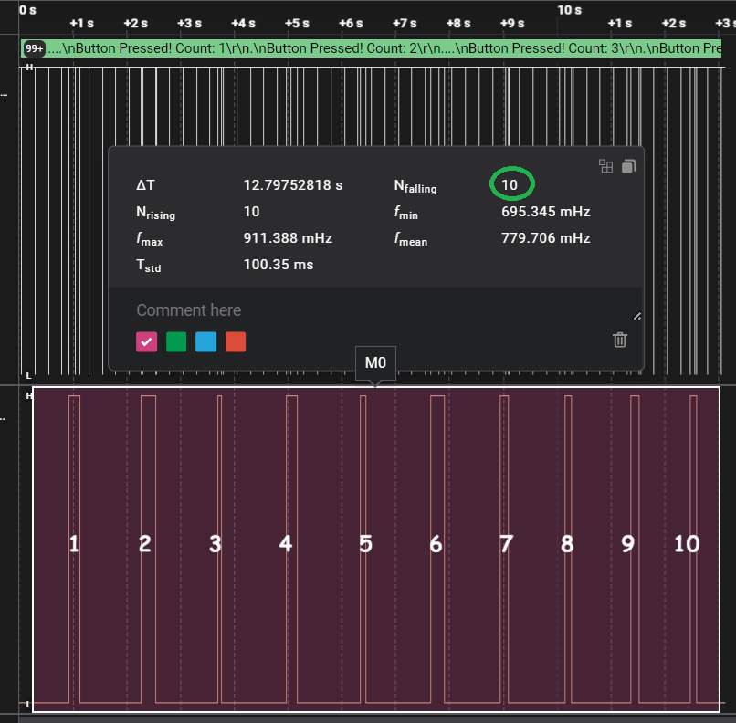

# Модуль 1.5. Звіт

## Завдання

[README.md](../README.md)

## Хід роботи

### Код

[main.cpp](../src/main.cpp)

### Експеримент 1. Output на кожному FALLING

Кнопка натиснута 10 разів, а в monitor відображається 18 "Button Pressed!" чезез bounce. На зображенні з логічого аналізатора видно 18 FALLING.

Бразкіт з'являється при повільнішому натисканні-відпусканні кнопки. А пропускається при попаданні на затримку.

Середня тривалість брязкоту порядка 100 мікросекунд.

Мінімальний debounce у розмірі max bounce duration повинен програмно вирішити проблему.

### Експеримент 2. Program debounce

Додан програмний фільтр у розміра 5 мілісекунд

Кнопка натиснута 10 разів, в monitor відображається 10 "Button Pressed!" - фільтр вирішив проблему на програмному рівна.

Але на зображенні з логічого аналізатора все ще видно видно 13 FALLING.

### Експеримент 3. Конденсатор

Паралельно кнопці додан конденсатор розміром 10 нФ.

Як відно на зображенні з логічого аналізатора 10 натискань дають 10 FALLING.
