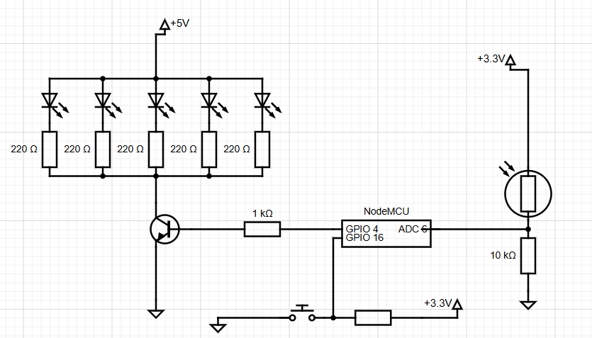

# Міні-проєкт: підключення сенсора і актуатора, відладчик

## Device Structure

### Mode Controller

|Component | Pin | Connection |
|-|-|-|
| Button Module with pull-down | GPIO 4 | VCC (3.3V) -> Signal ->  GND  |
| Built-in LED  | LED_BUILTIN | |

Перемикання режиму роботи пристрою відбувається циклічно при кожному натисканні кнопки. Внутріній світлодіод - індикатор обраного режиму.

- FORCE_OFF - світлодіод вимкнено
- FORCE_ON - світлодіод світиться
- AUTO - світлодіод блимає

### Sensor

Аналоговий сенсор для визначення рівня освітленості підключений як дільник напруги. Використовує гістерезис для запобігання мерехтінню.

| Component | Pin | Connection | Notes |
|-|-|-|-|
| LDR | GPIO 6 | VCC (3.3V) -> **LDR** -> Pin -> Resistor -> GND | High-side Voltage Divider |
| Resistor 10 kOm | - | VCC (3.3V) -> LDR -> Pin -> **Resistor** -> GND | High-side Voltage Divider |

Перемикання актуатора за допомогою сенсора включається в режимі AUTO.

### Actuator

Стан актуатора при різних режимах роботи пристрою:

- FORCE_OFF - актуатор постійно вимкнено
- FORCE_ON - актуатор постійно увімкнено
- AUTO - актуатор міняє стан від спрацьовування сенсору

#### Led Actuator

Жовтий зовнішній світлодіод - актуатор.

Розрахуємо резистор для жовтого світлодіода $U_f=2 \ V$ і струму $I = 10 \ mA$

$$ R = \frac{U_{cc} - U_f}{I} = \frac{3.3 - 2}{0.01} \approx 130 \ Om $$

Візьмемо мінімальний з наявних $R=220 \ Om$

$$ I = \frac{3.3-2}{220} \approx 6 \ mA $$

> Безпечно, але буде світити менш яскраво

| Component | Pin | Connection | Notes |
|-|-|-|-|
| Yellow LED 2 V | GPIO 16 | Pin -> Resistor -> **Anode** -> **Cathode** -> GND | Signal Output |
| Resistor 220 Om | GPIO 16 | Pin -> **Resistor** -> Anode -> Cathode -> GND | Current limiting |

#### 5 Led Actuator & Transistor

Парлельно 5 жовтих світлодіодів від 5 V керовані через NPN транзистор.

Оскільки мінімальний $R = 220 \ Om$. Розрахуємо струм для жовтого світлодіода $U_f=2 \ V$

$$ I_{led} = \frac{U_{cc} - U_f - U_{ce}}{R} = \frac{5 - 2 - 0.2}{220} \approx 12.7 \ mA $$

Розрахуємо струм для 5 паралельних світлодіодів

$$ I_c= 5 \times I_{led}=5 \times 12.7 \ mA \approx 63 \ mA $$

> Перевищуж max 40mA для GPIO, тому використовується окрема лінія через транзистор

Розрахуємо необхідний струм на базу транзистора при коефіцієнті підсилення $h_{FE}=110$

$$ I_b =\frac {I_c}{h_FE} = \frac{63 \ mA}{110} \approx 0.57 \ mA $$

Важливо, щоб транзистор точно розкркрозкрився повністю, тому вводять коефіцієнт запасу рівний 2 або 5, $I_b = 0.57 \ mA \times 5 = 2.85 \ mA$

Розрахуємо резистор на базі від GPIO, враховуючи стандартну напругу на база-емітер $U_{be}=0.7 \ V$

$$ R = \frac{3.3 - 0.7}{2.85 \ mA} \approx 912 \ Om \approx 1 \ kOm$$

| Component | Pin | Connection |
|-|-|-|
| 5 Yellow LED 2 V | - | VCC -> Resistor -> **Anode** -> **Cathode** -> Collector |
| 5 Resistor 220 Om | - | VCC -> **Resistor** -> Anode -> Cathode -> Collector |
| Transistor BC547 (NPN) | GPIO 16 | Pin -> Resistor -> **Base**   VCC -> Resistor -> Anode -> Cathode -> **Collector**   **Emiter** -> GND |
| Resistor 1 kOm | - | Pin -> **Resistor** -> Base | 

