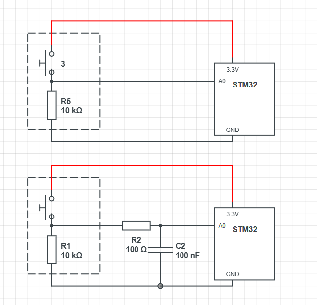
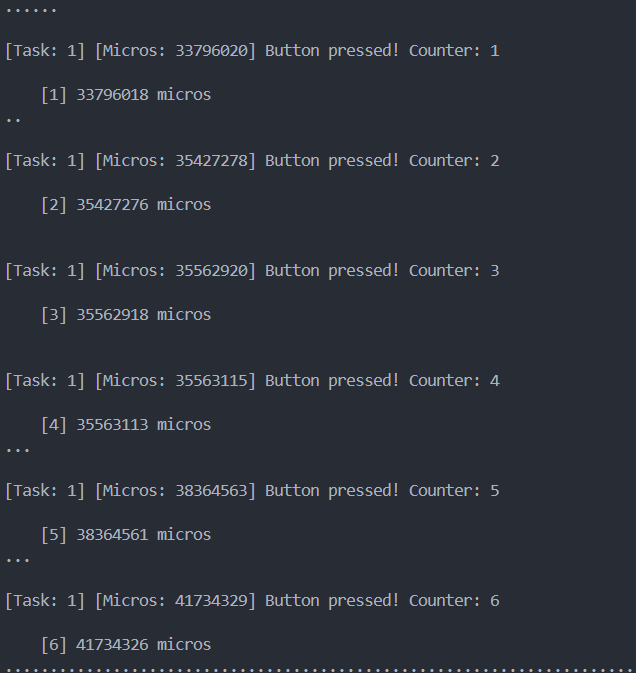
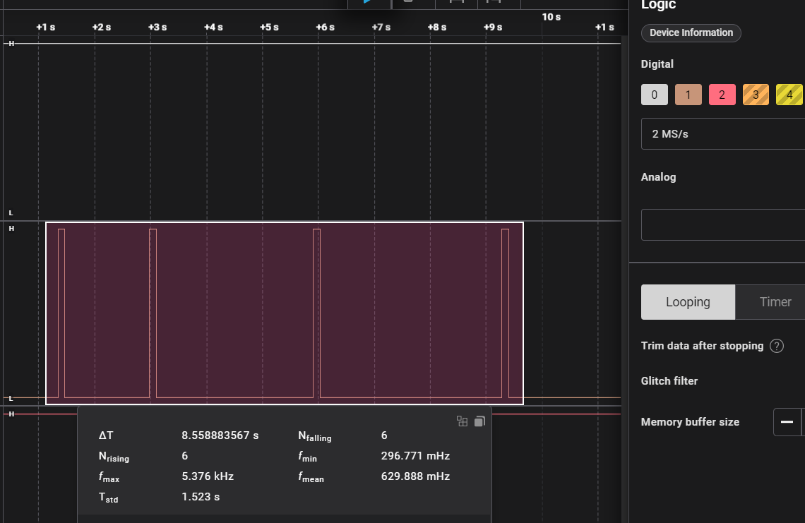
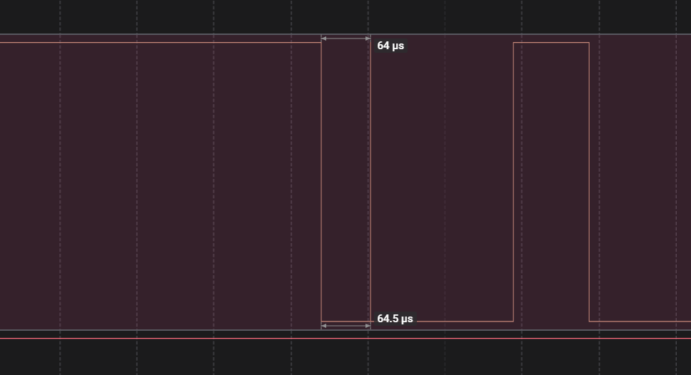
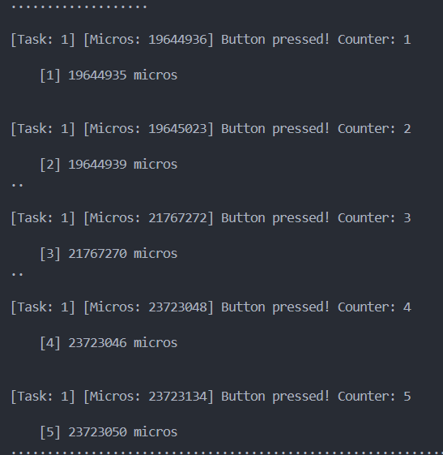
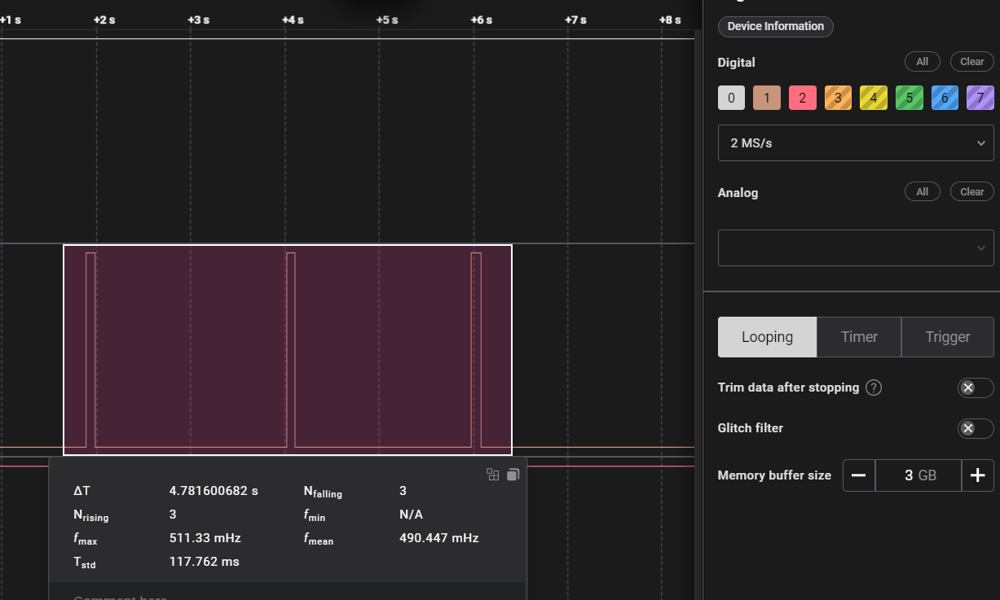

## Схема

STM32, Arduino Framework.

Button Module з вбудованим Pull Down резистором 10 КОм. Тому, навідміну від Pull UP

1. Реєструємо пін на INPUT: pinMode(BUTTON_PIN, INPUT);
2. В завданні сказано "Реалізувати GPIO interrupt на `FALLING`", але в нашому випадку момент натискання - `RISING`.

## Завдання 6: Порівняльна таблиця

### Без RC-фільтра

Фізичних натискань - 10.

| Метод        | Кількість хибних спрацювань | Затримка      | Складність |
|--------------|-----------------------------|---------------|------------|
| Без debounce |       6                     |    ні         |     1      |
| Time-based   |       5                     |    ~50мс      |     2      |
| State-based  |       3                     |    ні         |     2      |
| Polling      |       0                     |    10мс       |     3      |

Polling - найстабільніший.

В варіантах "Без debounce" та "Time-based" зустрічались по 3 хибні спрацювання за раз.

Наприклад, найпростіший варіант реалізації "Без debounce".

- затримка між перериванням та loop ~2 мкс
- на скріншоті приклад брязкоту: ~64 мкс, ~184 мкс.

### RC-фільтр

Логічний аналізатор на частоті 2 MS/s не показав жодного зайвого RISING в усіх варіантах - RC-фільтр прибрав брязкіт.

$$t_{заряд}=100 \ Ом \times 100 \ нФ=10 \ мкс$$

$$t_{розряд}=10 \ кОм \times 100 \ нФ=1 \ мс$$

Варіанти "State-based" та "Polling" не показали жодного хибного спрацювання.

Неочікувана проблема: не дивлячись на те, що логічний аналізатор не показав жодного зайвого RISING, варіанти "Без debounce" та "Time-based" майже стабильно відображали подвійне спрацювання переривання з різницею ~4 мкс. Не було жодного потрійного хибного спрацювання

