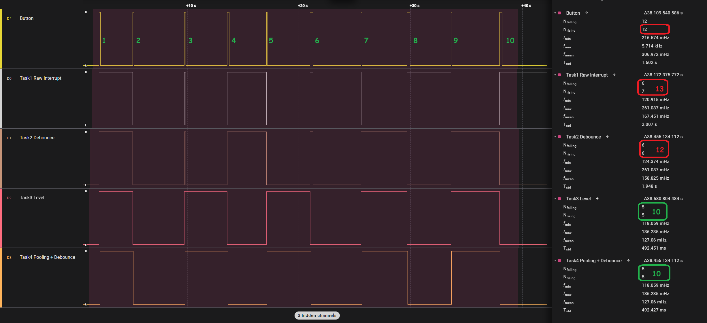
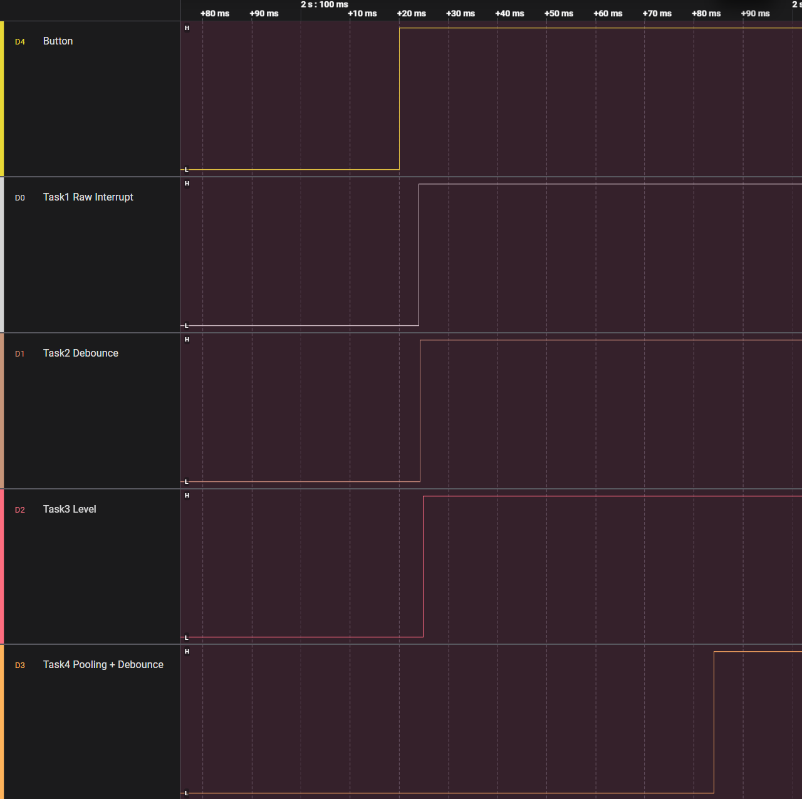

## Порівняння

| Метод | Кількість хибних спрацювань з 10 | Затримка | Складність | ISR | Коментар |
|---|---|---|---|---|---|
| Task 1 Без debounce        | висока (3-4)   | відсутня | мінімальна | [x] | кожен bounce - подія |
| Task 2 Time-based          | середня (2-3)  | відсутня | низька     | [x] | ігнорує всі події протягом часу |
| Task 3 State-based         | низька (0-1)  | відсутня | низька     | [x] | перевіряє рівень після ISR |
| Task 4 Polling + debounce  | відсутня (0) | ~50ms    | середня    | [-] | машина станів з ігноруванням всх подій протягом часу|


## Logig Analyzer




## Serial Monitor

```
I (10237) LOGGER: .
I (12237) LOGGER: .
I (13707) TASK 1 RAW INTR: Button Pressed: 1
I (13707) TASK 2 DEBOUNCE: Button Pressed: 1
I (13707) TASK 3 LEVEL ST: Button Pressed: 1
I (13767) TASK 4 POOL&DEB: Button Pressed: 1
I (14237) LOGGER: .
I (16237) LOGGER: .
I (16717) TASK 1 RAW INTR: Button Pressed: 2
I (16717) TASK 2 DEBOUNCE: Button Pressed: 2
I (16717) TASK 3 LEVEL ST: Button Pressed: 2
I (16777) TASK 4 POOL&DEB: Button Pressed: 2
I (18237) LOGGER: .
I (20237) LOGGER: .
I (21337) TASK 1 RAW INTR: Button Pressed: 3
I (21337) TASK 2 DEBOUNCE: Button Pressed: 3
I (21337) TASK 3 LEVEL ST: Button Pressed: 3
I (21397) TASK 4 POOL&DEB: Button Pressed: 3
I (21457) TASK 1 RAW INTR: Button Pressed: 4
I (21457) TASK 2 DEBOUNCE: Button Pressed: 4
I (22237) LOGGER: .
I (24237) LOGGER: .
I (25167) TASK 1 RAW INTR: Button Pressed: 5
I (25167) TASK 2 DEBOUNCE: Button Pressed: 5
I (25167) TASK 3 LEVEL ST: Button Pressed: 4
I (25227) TASK 4 POOL&DEB: Button Pressed: 4
I (26237) LOGGER: .
I (28237) LOGGER: .
I (28677) TASK 1 RAW INTR: Button Pressed: 6
I (28677) TASK 2 DEBOUNCE: Button Pressed: 6
I (28677) TASK 3 LEVEL ST: Button Pressed: 5
I (28737) TASK 4 POOL&DEB: Button Pressed: 5
I (30237) LOGGER: .
I (32237) LOGGER: .
I (32587) TASK 1 RAW INTR: Button Pressed: 7
I (32587) TASK 2 DEBOUNCE: Button Pressed: 7
I (32587) TASK 3 LEVEL ST: Button Pressed: 6
I (32647) TASK 4 POOL&DEB: Button Pressed: 6
I (32867) TASK 1 RAW INTR: Button Pressed: 8
I (32867) TASK 2 DEBOUNCE: Button Pressed: 8
I (34237) LOGGER: .
I (36237) LOGGER: .
I (37147) TASK 1 RAW INTR: Button Pressed: 9
I (37147) TASK 2 DEBOUNCE: Button Pressed: 9
I (37147) TASK 3 LEVEL ST: Button Pressed: 7
I (37157) TASK 1 RAW INTR: Button Pressed: 10
I (37207) TASK 4 POOL&DEB: Button Pressed: 7
I (38237) LOGGER: .
I (40237) LOGGER: .
I (41267) TASK 1 RAW INTR: Button Pressed: 11
I (41267) TASK 2 DEBOUNCE: Button Pressed: 10
I (41267) TASK 3 LEVEL ST: Button Pressed: 8
I (41327) TASK 4 POOL&DEB: Button Pressed: 8
I (42237) LOGGER: .
I (44237) LOGGER: .
I (45187) TASK 1 RAW INTR: Button Pressed: 12
I (45187) TASK 2 DEBOUNCE: Button Pressed: 11
I (45187) TASK 3 LEVEL ST: Button Pressed: 9
I (45247) TASK 4 POOL&DEB: Button Pressed: 9
I (46237) LOGGER: .
I (48237) LOGGER: .
I (49537) TASK 1 RAW INTR: Button Pressed: 13
I (49537) TASK 2 DEBOUNCE: Button Pressed: 12
I (49537) TASK 3 LEVEL ST: Button Pressed: 10
I (49597) TASK 4 POOL&DEB: Button Pressed: 10
I (50237) LOGGER: .
I (52237) LOGGER: .
```
