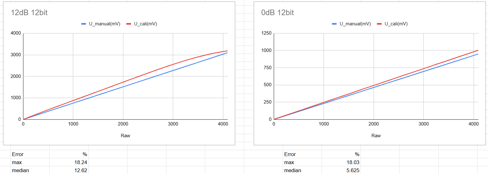
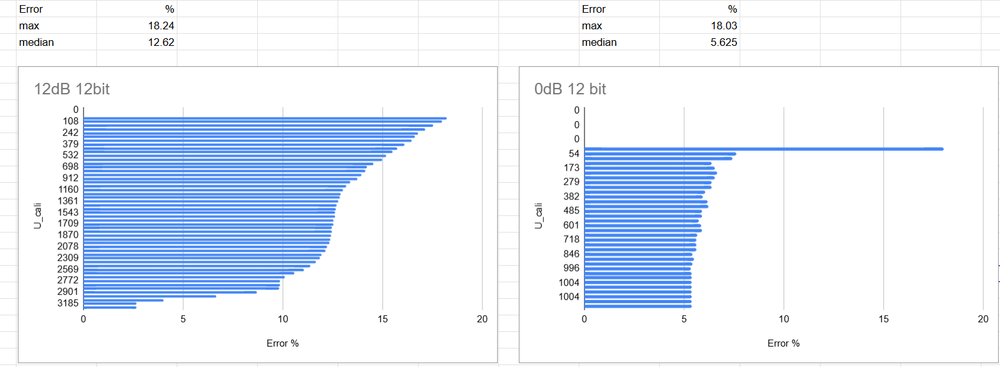

# Аналогові сигнали: як мікроконтролер перетворює напругу з датчика на число

## Конфігурація експерименту

Було проведено два цикли вимірювань із використанням потенціометра як дільника напруги.
Порівнювалися значення, розраховані вручну ($U_{manual}$), та значення, отримані через драйвер калібрування ESP-IDF ($U_{cali}$).

| Параметр               | Тест №1             | Тест №2              |
|------------------------|---------------------|----------------------|
| Атенюація              | 12 dB (до ~3.1В)    | 0 dB (до ~1.1В)      |
| Розрядність (Bitwidth) | 12-bit (0-4095)     | 12-bit (0-4095)      |

## Результати вимірювань (Error %)

Похибка розраховувалася як відхилення «ідеальної» лінійної формули від каліброваної кривої.

| Конфігурація     | Max     | Median  |
|------------------|---------|---------|
| 12 dB / 12-bit   | 18.24% | 12.62% |
| 0 dB / 12-bit    | 18.03% | 5.625% |

## Аналіз графіків та висновки

Основні спостереження:

- **Нелінійність при 12 dB:** На графіку чітко видно вигин. Це підтверджує, що вбудований атенюатор ESP32 вносить суттєві викривлення, які драйвер `adc_cali` намагається компенсувати.

- **Лінійність при 0 dB:** Графік майже прямий. Це свідчить про більшу точність нативного діапазону АЦП, без додаткових внутрішніх перетворень.

- **Нижній поріг:** В обох режимах спостерігається пікова похибка (~18%). Це зумовлено нелінійністю АЦП поблизу нуля.

- **Верхній поріг та насичення (Saturation):**
    - У режимі **0 dB** чітко видно "стелю" на рівні ~1000 мВ, після якої вимірювання неможливі.
    - У режимі **12 dB** похибка вгорі діапазону (біля 3000 мВ) несподівано менша, ніж у середній зоні. Це свідчить про те, що обрана константа `maxVoltage` у добре описує саме верхню межу робочого діапазону, хоча середина шкали залишається викривленою через атенюацію.

- **Вікно вимірювань при 0 dB:** При 0 дБ АЦП має дуже вузьке вікно роботи
