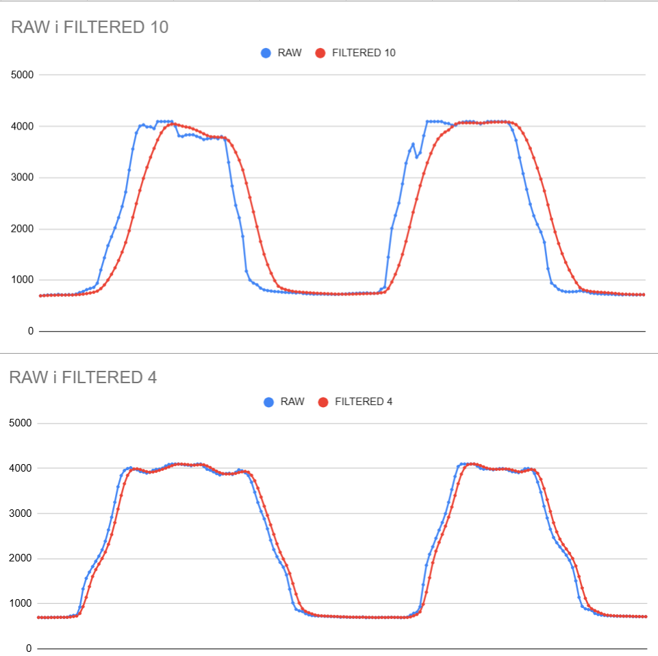
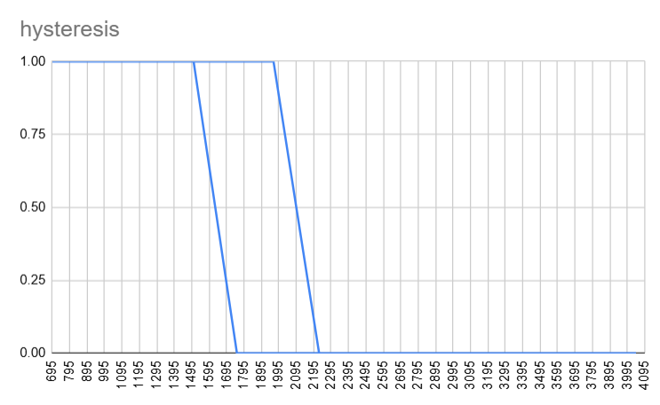

# Проста ковзна середня (SMA) та Гістерезис

## SMA-фільтрація

**Вікно 4**: Мінімальна затримка, але слабше пригнічення шуму.

**Вікно 10**: Значне згладжування сигналу. Помітна затримка, через швидку зміну освітлення.

**Висновок**: Розмір вікна - це компроміс між чистотою сигналу та швидкістю реакції системи.

## Гістерезис

**Реалізація**: Два пороги 1700 та 2000 RAW створюють "зону спокою".

**Результат**: Повністю усунуто мерехтіння LED на межі спрацювання.

